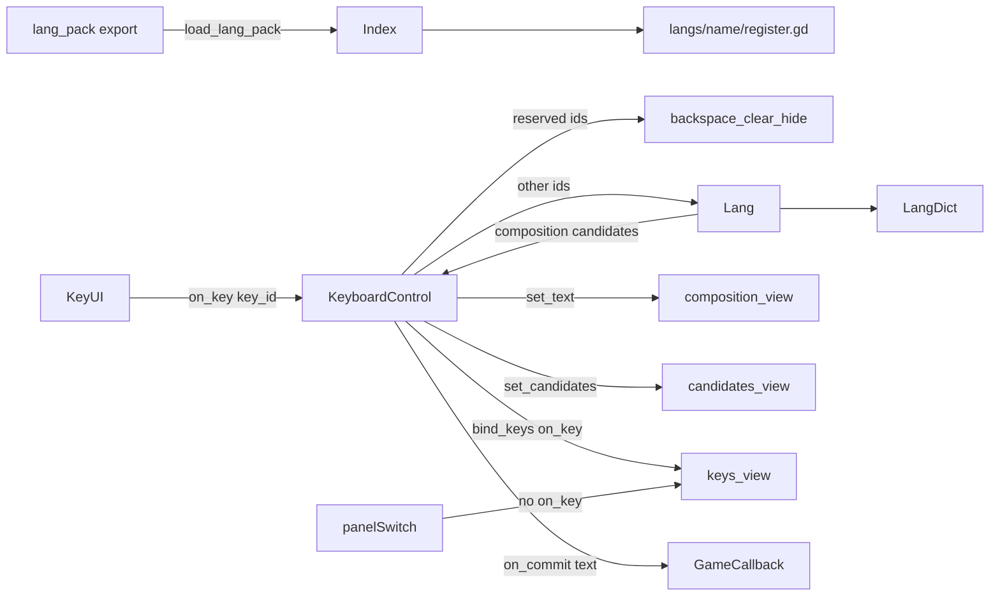

# UzKeyboard 概觀

Godot 4 螢幕虛擬鍵盤：以 `Control` + GDScript 實作。鍵盤轉發按鍵與組字狀態；**畫面**在可抽換的 View 裡；**組字、候選、字典**都在可抽換的語言包裡。v0.1 附台灣注音包（繁體候選）與注音皮膚 View，以及拼音包（正體候選、QWERTY 皮膚）。

遊戲不綁 `LineEdit`：選字後透過 `on_commit(text)` 交給專案自行附加。

## 概念

層分開，避免把某一語言的組字規則寫進鍵盤 Control，也避免把控件型別寫進語言：


| 層                            | 角色                                                                                                    |
| ---------------------------- | ----------------------------------------------------------------------------------------------------- |
| **索引 Autoload** `UZKeyboard` | 載入核心類別、依名稱載入語言包、註冊語言腳本。不登記具體 View 皮膚。其他腳本只認這個名稱，不認索引檔路徑。                                              |
| **鍵盤 Control**               | `@export lang_pack` 指定 `langs/{name}`；把 composition / candidates 交給 View；`bind_keys(on_key)`；依 `key_id` 呼叫語言或殼層鍵；`on_commit`。 |
| **View**                     | 皮膚：組字 / 候選 / 按鍵可分三個物件或同一物件。有對應方法才呼叫。在場景用 `@export` 指定。可專屬於某一語言（面板切換、額外鍵面）。鍵面由 View 自定。 |
| **語言包 Lang pack**            | `langs/{name}/register.gd` 向索引註冊。實作組字緩衝、查字典、`handle_key`、composition / candidates。不提供鍵排。 |


語言不知道按鈕怎麼排、幾個面板；鍵盤與索引不知道「聲母／介音／韻母」或拼音字母緩衝。View 負責怎麼顯示，不必做成萬用鍵盤。加拼音不必改 Control 或索引；皮膚另做 View 掛在場景上。



## 邏輯

### 啟動

1. 啟用外掛後，Autoload `UZKeyboard`（`index_uzkeyboard.gd`）在 `_ready` 呼叫 `index()`。
2. 用 `G.load_script` 載入 `Keyboard` / `Lang` / `View` / `Candidates`。此時尚未載入任何語言。不載入 View 皮膚。
3. 若場景有 `UREQ`，再 `gbind` 一份索引，方便走 UREQ；沒有 UREQ 時 Autoload 仍可直接用。
4. 場景實例化 `scenes/uzkeyboard.tscn`（根 Control + 注音 View 子節點，`@export` 已指好）。Inspector 設 `lang_pack`（例如 `zhuyin`）。
5. Control `_ready`：`_ensure_views()`（只用有對應方法的 `@export`）→ `load_lang_pack(lang_pack)` → `register(index)` → `set_lang` → `bind_keys(on_key)`。

未指定 View 的槽不會自動長 UI。

### 一次按鍵

1. View 對可輸入鍵與殼層鍵呼叫 `on_key(key_id)`。面板切換、`shift`、`ea_width` 只改 View，不進 `on_key`。
2. 殼層 id（`backspace` / `clear` / `hide`）由鍵盤處理，不進語言。其餘 → `lang.handle_key(key_id)` → `{ composition, candidates, commit? }`。
3. 鍵盤 `set_text`、`set_candidates`（有方法的 View 才呼叫）。
4. 若有 `commit`，呼叫 `on_commit`。
5. 點候選：`lang.select(index)` → 字串 → `on_commit`，並清空組字。
6. 退格：組字非空則 `lang.backspace()`；已空則 `on_backspace`（讓遊戲刪已送出的字）。
7. 清除只清組字；隱藏只設 `visible`。

殼層鍵由 **View** 產生，仍用保留 id，與語言鍵同一條 `on_key`。空白若要送出字元，View 發 `space`（不是殼層 id）。

### 語言介面（duck-typed）

語言包**不必** `extends` `uzkeyboard_lang.gd`。該檔只是方法清單參考。鍵盤以 `has_method` 呼叫，缺方法則略過：

- `get_id()`
- `handle_key(key_id)` → `{ composition, candidates, commit? }`
- `get_composition()` / `get_candidates()`
- `select(index)` → 要送出的字串
- `backspace()` / `clear()`
- 可選：`load_dict(path)` / `set_opts(dict)`

`id` 用穩定名稱（如 `&"b"`、`&"tone_3"`），畫面標籤才是 `ㄅ`、`ˇ`。語言包不要使用殼層保留 id：`backspace`、`clear`、`hide`。

注音大千鍵占用了 `&"a"` 等英文字母 id。View 英文鍵改用 `chr_a` 這類 id，語言再直接 `commit` 字元。

### View 介面（duck-typed）

View **不必** `extends` `uzkeyboard_view.gd`。三個 `@export` 可指向不同 Node，或同一個 Node 實作多個方法。只在 `has_method` 時呼叫：

- `set_text(txt)` — 組字
- `set_candidates(arr, on_select)` — `on_select(index)`
- `bind_keys(on_key)` — View 自備鍵面並 `on_key(key_id)`。殼層與切換鈕由 View 處理。

可混用（例如只自訂 `keys_view`）。皮膚腳本掛在 tscn 上，不經索引 `new()`。

### 語言包慣例

`langs/{pack_name}/register.gd`：

```gdscript
func register (index) -> StringName :
	# G.load_script 本包語言腳本
	# index.import_lang_script(id, script)
	return id
```

索引只認資料夾名與 `register.gd`，不內建任何語言 id。

### 注音包（v0.1）

`langs/zhuyin/`：

- View 排 大千鍵面（見皮膚 tscn）。語言只認 `key_id`（聲母／介音／韻母／聲調／`space`）。
- 組字槽順序：**聲母 → 介音 → 韻母 → 聲調**。不合順序的鍵忽略。
- 字典 JSON：`大千 keycode → 字串陣列`（例如 `2j6` → `毒`）。組字列仍顯示注音；查詢前把注音轉成 keycode。有聲調則精確查；無聲調則合併該音節各調（keycode 後綴 `6/3/4/7`）。
- 空白：有候選則選第一個；組字空則 `commit` 一個空白字元。
- 預設表：`langs/zhuyin/data/bpmf.json`（由同目錄 `bpmf.cin` 以 `langs/zhuyin/tools/cin_to_json.py` 轉出，可 `load_dict` 換成其他 keycode 表）。
- 皮膚 `uzkeyboard_view_zhuyin.tscn` + `.gd`：底對齊 Control。`@export` 組字 / 候選容器 / 三個面板 / `bar_candi`（組字+候選列；僅注音層且有組字或候選時顯示）。按鍵用節點名（如 `b`、`to_en`、英文層 `q`）。面板切換、`shift`、`ea_width` 不進 `on_key`。英文鍵 id 為 `chr_x`。符號 `ea_width` 切 ASCII／全形。`space` / `backspace` 在各層鍵列，走 `on_key`。掛在 `scenes/uzkeyboard.tscn`。

### 拼音包（v0.1）

`langs/pinyin/`：

- View 排 QWERTY 字母 + 聲調 `1`–`5`（`5` 畫面為 `˙`）。語言組字為羅馬拼音字串；`v` 對表裡的 ü（如 `lv4`）。
- 字典 JSON：`pinyin → 字串陣列`（正體 CNS 表）。有聲調則精確查；無聲調則合併該音節 `1`–`5` 與無調鍵。其餘前綴鍵依 cin 首次出現序補滿，候選前綴封頂 40。
- 空白：有候選則選第一個；組字空則 `commit` 一個空白字元。字母後已有聲調則忽略再按的字母。
- 預設表：`langs/pinyin/data/pinyin.json`（由 `pinyin.cin` 以 `langs/pinyin/tools/cin_to_json.py` 轉出；該 cin 的 `%chardef begin` 為單空白，不可套用注音轉換器的雙空白比對）。可 `load_dict` 換表。
- 皮膚 `uzkeyboard_view_pinyin.tscn` + `.gd`：與注音相同底對齊與英／符號面板。`to_py` 回拼音層。`bar_candi` 僅拼音層且有組字或候選時顯示。英文鍵仍為 `chr_x`。不掛預設 `scenes/uzkeyboard.tscn`；見 `langs/pinyin/test_uzkeyboard_pinyin.tscn`。

### 送出 API

鍵盤 Control：

```gdscript
keyboard.lang_pack = &"zhuyin"           # 或 &"pinyin"；Inspector / _ready 時載入包
keyboard.set_commit_handler(func (text : String) : ...)
keyboard.on_backspace = func () : ...   # 組字已空仍退格
keyboard.set_lang(&"zhuyin")             # 包已註冊後可再切
keyboard.register_lang(&"pinyin", some_script)
keyboard.show_keyboard() / hide_keyboard()
# View 在場景指定（缺方法則該槽不更新）
keyboard.composition_view = some_node   # set_text
keyboard.candidates_view = some_node    # set_candidates
keyboard.keys_view = some_node          # bind_keys
```

範例：`_test/test_uzkeyboard.tscn` 使用 `scenes/uzkeyboard.tscn`（注音 View），`lang_pack = zhuyin`，commit 接到 Label。

開發 coop：`_test/test_uzkeyboard_example.tscn` 使用 `uzkeyboard_view_example.gd` 與 `lang_pack = direct`。Example 自列英文 `chr_x` 與符號鍵成橫向捲動，不向語言要鍵排。

### Direct 包

`langs/direct/`：無組字、無字典。`handle_key` 把 `space` / `chr_x` / 單一字元 id 直接 `commit`。給只打英數符號的 View 用。

## 結構

```
addons/uzkeyboard/
  plugin.cfg
  addon_uzkeyboard.gd          # EditorPlugin：註冊 Autoload UZKeyboard
  overview.md
  scripts/
    index_uzkeyboard.gd        # Autoload 索引（核心類別 + 語言表）
    uzkeyboard.gd              # 鍵盤 Control：lang_pack + View 轉發
    uzkeyboard_lang.gd         # 語言方法清單參考 (不必繼承)
    uzkeyboard_view.gd         # View 方法清單參考 (不必繼承)
    uzkeyboard_view_example.gd # 開發示例：自備英數符號橫向捲動
    uzkeyboard_candidates.gd   # 候選按鈕重建（無 Control 子類）
  langs/
    direct/
      register.gd
      uzkeyboard_lang_direct.gd  # 直接 commit key 字元
    zhuyin/
      register.gd
      uzkeyboard_lang_zhuyin.gd
      uzkeyboard_dict_zhuyin.gd
      uzkeyboard_view_zhuyin.gd   # 注音皮膚腳本（場景指定, 不進索引）
      uzkeyboard_view_zhuyin.tscn # 注音鍵面
      data/
        bpmf.cin               # 大千 keycode 字表來源
        bpmf.json              # 執行期字典 (keycode → 字)
      tools/
        cin_to_json.py         # cin → json
    pinyin/
      register.gd
      uzkeyboard_lang_pinyin.gd
      uzkeyboard_dict_pinyin.gd
      uzkeyboard_view_pinyin.gd
      uzkeyboard_view_pinyin.tscn
      test_uzkeyboard_pinyin.tscn
      data/
        pinyin.cin             # CNS 正體拼音來源（大檔, 勿整份讀進編輯器）
        pinyin.json            # 執行期 { table, keys }
      tools/
        cin_to_json.py
        build_view_tscn.py
  scenes/
    uzkeyboard.tscn            # Control + 注音 View 子節點
  _test/
    test_uzkeyboard.tscn       # lang_pack = zhuyin, 用 packaged 場景
    test_uzkeyboard_example.tscn
    test_uzkeyboard.gd         # @export 接 Label / 鍵盤
```

索引公開：`Keyboard`、`Lang`、`View`、`Candidates`，以及 `load_lang_pack` / `import_lang_script` / `get_lang_script` / `new_lang`。語言腳本以 `G.load_script` 載入，**不用** `preload`。UI 不用 `@onready` / `$path`。View 皮膚不進索引。

## 範圍（v0.1）

有：螢幕鍵盤、注音語言包、拼音語言包（正體、音節、無詞聯想）、direct 直出包、注音／拼音皮膚（英/符號面板）、繁體候選、callback 送出、可換語言介面、場景指定 View、ViewExample。

沒有：實體鍵盤 IME、簡體預設表、詞聯想、系統 IME 取代、內建 LineEdit 綁定。
